## Results Summary

This file is the reader-friendly discussion of numerical results. The README tells readers what the project is; this file should tell them what we learned. For the detailed results, please refer to the [`notebooks`](../notebooks/).

### Recommended Reading Flow

1. Read [`README.md`](../README.md) for the project purpose and setup.
2. Read this file for the main numerical conclusions.
3. Open the relevant notebook for details, code, tables, and plots(if any).
4. Use [`METHOD_REFERENCES.md`](METHOD_REFERENCES.md) to connect each method to its source.
___

## Black-Scholes Model
### European Options

<table>
  <tr>
    <td align="center">
      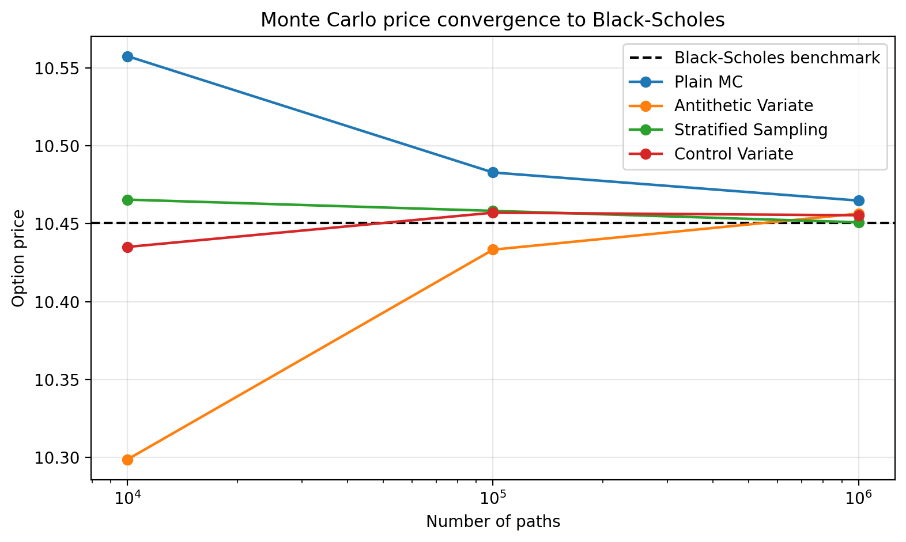 
    </td>
    <td align="center">
      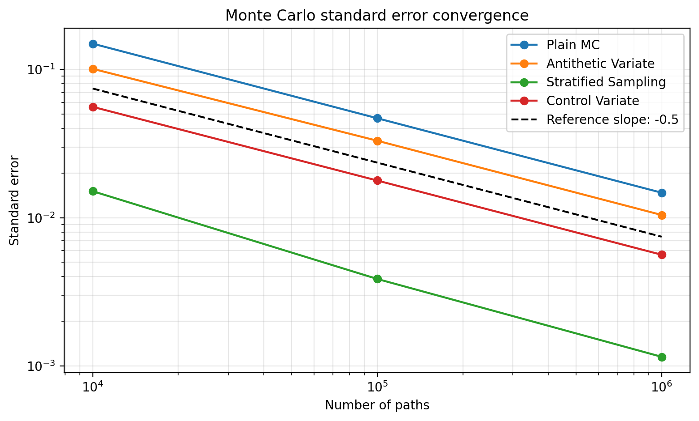 
    </td>
  </tr>
</table>
All Monte Carlo estimators fluctuate around the Black-Scholes closed-form benchmark rather than approaching it monotonically. This is because increasing the number of paths narrows the estimator distribution, but any single run can still land above or below the true price. The standard-error plot gives the clearer convergence message. Plain Monte Carlo follows the theoretical $M^{-1/2}$ decay rate, while variance reduction methods mainly improve the level of the error rather than changing the asymptotic slope. Control variates reduce the error level by using the discounted stock as a highly correlated control (~93%) for the European call payoff. In this specific European Black-Scholes example, terminal stratified sampling performs best because the payoff depends only on $S_T$, which is driven by a single terminal normal variable. Stratifying that variable directly gives much more even coverage of the distribution and sharply reduces standard error.

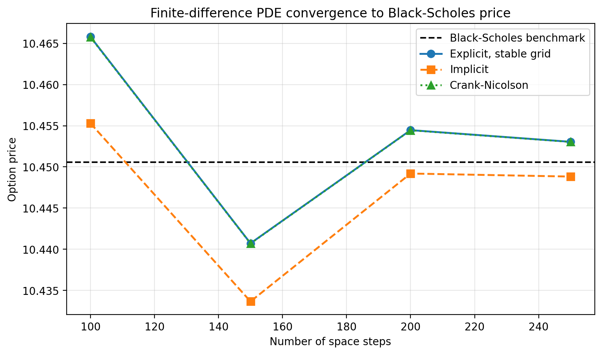
The PDE results show a more deterministic form of convergence because the error comes from discretising the stock-price and time grids. The explicit scheme highlights the main stability issue: the time step cannot be too large relative to the stock-price step. In practice, when $\Delta S$ is refined, $\Delta t$ must shrink roughly like $(\Delta S)^2$, especially near the upper end of the stock grid where the diffusion term is largest. If this condition is violated, small numerical errors are amplified and the solution can explode. Once the explicit scheme uses enough time steps, it becomes stable and converges toward the Black-Scholes price. The implicit and Crank-Nicolson schemes are more robust because they solve a tridiagonal system at each time step, making them much less sensitive to this explicit stability restriction.

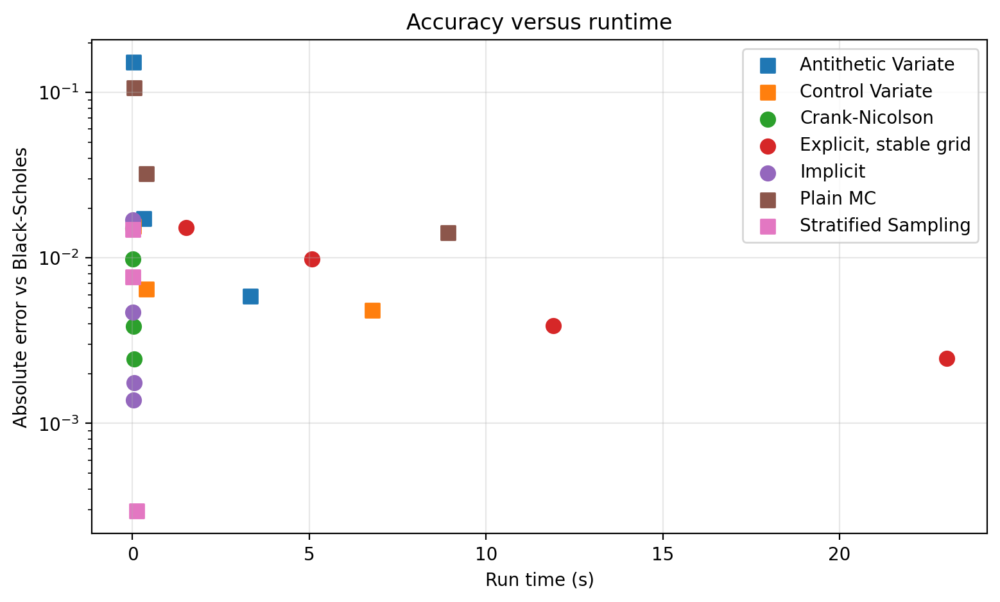
The runtime-versus-accuracy plot highlights the practical trade-off between numerical precision and computational cost. Monte Carlo methods are easy to implement and scale naturally with path count, but improving accuracy is slow because standard error decreases only at rate $M^{-1/2}$. Variance reduction can improve efficiency by lowering the standard error for a given number of paths, but some methods introduce extra computational time since they embed additional calculation steps. PDE methods, by contrast, can achieve high accuracy very quickly for a European vanilla option under Black-Scholes, because the pricing problem is reduced to solving a structured tridiagonal system on a one-dimensional grid. For this product and model, PDE is therefore the preferred method.

### American Options

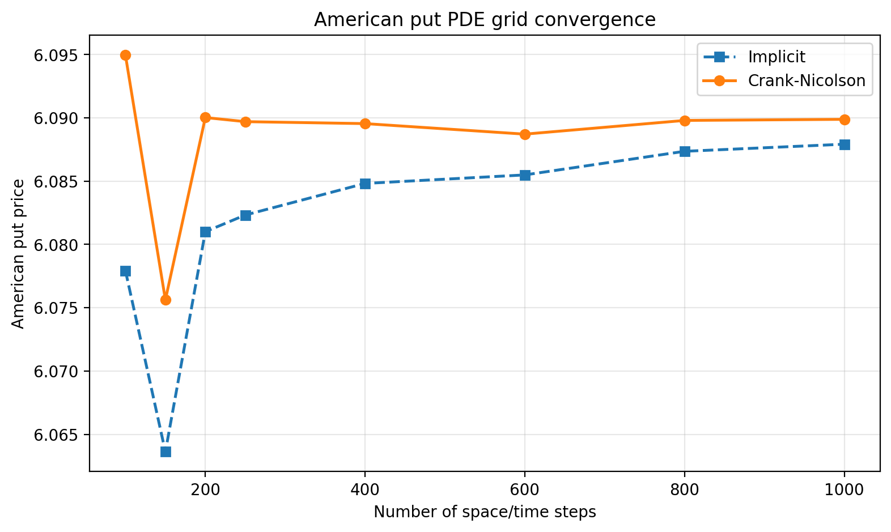
The PDE graphs show that the American put price stays safely above the European put lower bound, which is  expected due to the early-exercise right. As the grid is refined, both implicit and Crank-Nicolson stabilise around roughly 6.09, with an early-exercise premium of about 0.51 over the analytically evaluated European put. With second-order time accuracy, Crank-Nicolson converges more quickly while the implicit scheme approaches the same region more gradually. Runtime increases with grid size, but remains very manageable: even the 1000 x 1000 grid runs in under a second in the saved results. This makes PDE a strong benchmark method for the American put in this one-dimensional Black-Scholes setting in absence of analytical benchmark.

<table>
  <tr>
    <td align="center">
      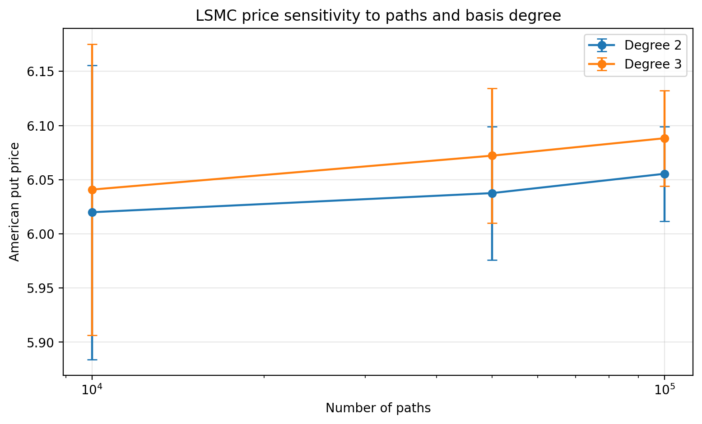 
    </td>
    <td align="center">
      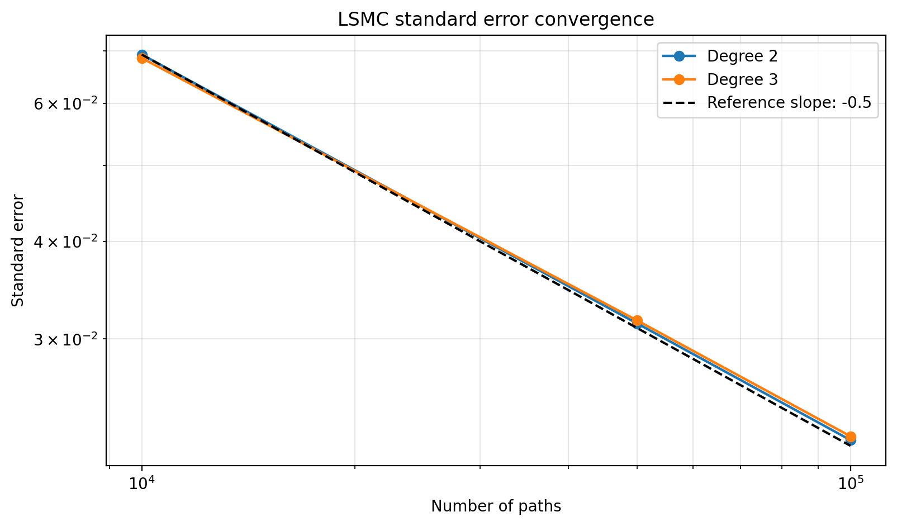 
    </td>
  </tr>
</table>
The LSMC graph shows the more statistical nature of Monte Carlo pricing. As the number of paths increases, the standard error falls clearly, roughly following the theoretical $M^{-1/2}$ decay rate. The price also moves closer to the PDE region, especially for the degree-3 basis at 100,000 paths, which gives a price around 6.09. The polynomial degree matters because it controls how flexibly the regression estimates continuation value: degree 2 is cheaper and more stable, while degree 3 captures more shape and gives a higher estimate here. Runtime is still reasonable, but grows with path count: around 0.18s for 10,000 paths and about 2.5-2.7s for 100,000 paths. So LSMC is slower and noisier than PDE for this simple American put, making PDE a better candidate method.

### Asian Options

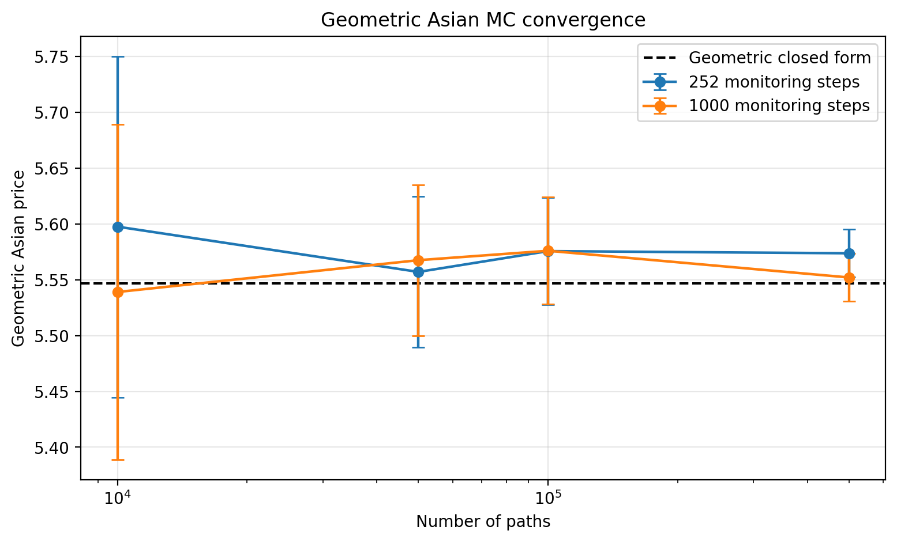
The geometric Asian option gives us a useful benchmark because it has a closed-form price under Black-Scholes. The Monte Carlo estimates fluctuate around this benchmark, with the standard error falling as the number of paths increases. The price error is not perfectly monotonic, which is normal for Monte Carlo, but the uncertainty (measured by 95% confidence intervals) clearly decreases with path count. The monitoring frequency becomes important due to the payoff's path dependent nature. Using more monitoring dates gives a finer approximation of the average, but it increases runtime because each simulated path carries more time steps. This is especially clear at 500,000 paths, where moving from 252 to 1,000 monitoring steps increased the runtime from 2.8s to 37.3s. So the geometric Asian experiment shows both sides of the trade-off: more paths reduce sampling error, while more monitoring steps improve path resolution but can become computationally expensive.

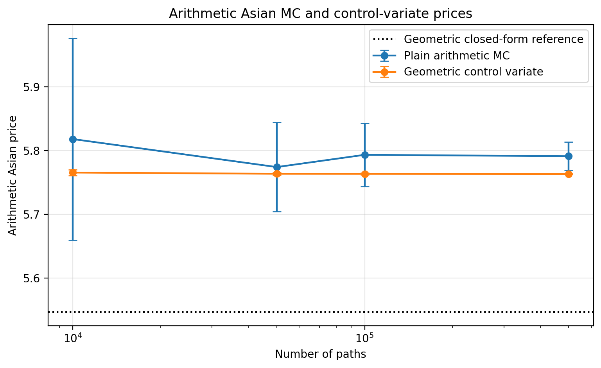
The arithmetic Asian price should be higher than the geometric Asian price with the same inputs. This is because stock prices are positive and the arithmetic average is always at least as large as the geometric average path by path. Since the call payoff is increasing in the average, the arithmetic payoff is also at least as large. The results are consistent with this: the arithmetic Asian prices sit above the geometric benchmark. Geometric control variate is much more efficient because the arithmetic than plain Monte Carlo because the two types of Asian payoffs are almost perfectly correlated ($\rho \approx 99.9\%$). In the optimal control-variate estimator, the variance is reduced by the factor $1 - \rho_{X,Y}^2$, where $Y$ is the target payoff and $X$ is the control payoff. Here $\rho_{X,Y}$ is close to one, so $1-\rho_{X,Y}^2$ is very small, which explains the small standard error even with 10,000 paths. This also explains why the European vanilla control variate was less powerful, which the discounted stock and a vanilla call payoff only has correlation $\rho \approx 93\%$. For the Asian option, the target and control are almost the same object, differing only by averaging method, so the control variate removes much more sampling noise. Runtime is slightly higher than plain MC because the control payoff, covariance, and beta adjustment must also be computed, but the reduction in standard error is large enough that the control variate is clearly the better method for the arithmetic Asian option.

### Barrier Options

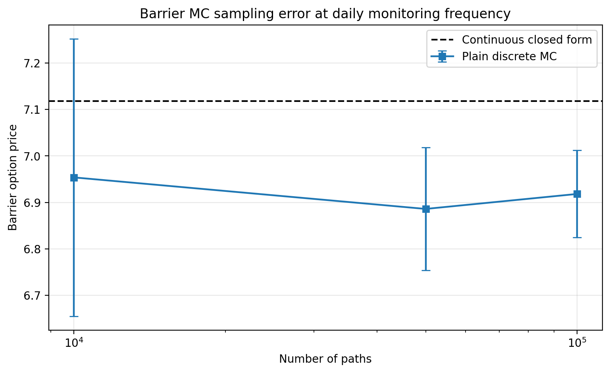
The first Monte Carlo graph shows the effect of increasing the number of simulated paths while keeping the monitoring frequency fixed at daily steps. Since this is an up-and-in call, the option only becomes active if the stock reaches the upper barrier before maturity. With ordinary discrete Monte Carlo, we only check the barrier at the simulated monitoring dates, so some paths that cross the barrier between dates are missed. This explains why the plain MC prices sit below the continuous-monitoring closed-form benchmark. Increasing the number of paths reduces sampling error, as shown by the falling standard error, but it does not remove the monitoring bias. Runtime increases with path count, from around 0.07s at 10,000 paths to about 0.50s at 100,000 paths, which is still manageable but does not fix the main issue.

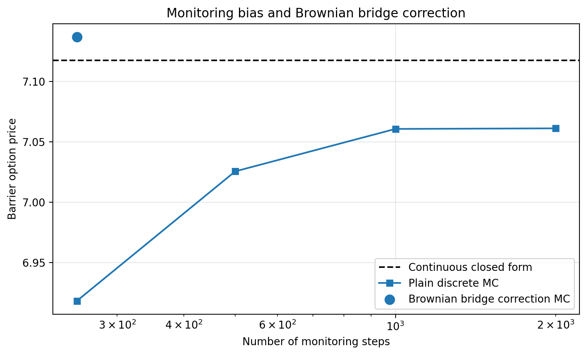
The monitoring-bias graph is the most important one for the barrier option. For an up-and-in call, missing an upward barrier crossing means incorrectly treating an active path as inactive, so discrete monitoring tends to underprice the option relative to continuous monitoring. As the number of monitoring steps increases, plain MC moves closer to the continuous benchmark because fewer crossings are missed. However, this becomes expensive: at 100,000 paths, moving from 252 to 2,000 monitoring steps increases runtime from around 0.41s to almost 5.92s. Brownian bridge correction gives a better trade-off since it captures missed activations without needing thousands of time steps. That is why the bridge-corrected estimate is much closer to the closed-form price using only 252 steps, although it is slower than plain daily MC because it performs extra crossing-probability calculations.

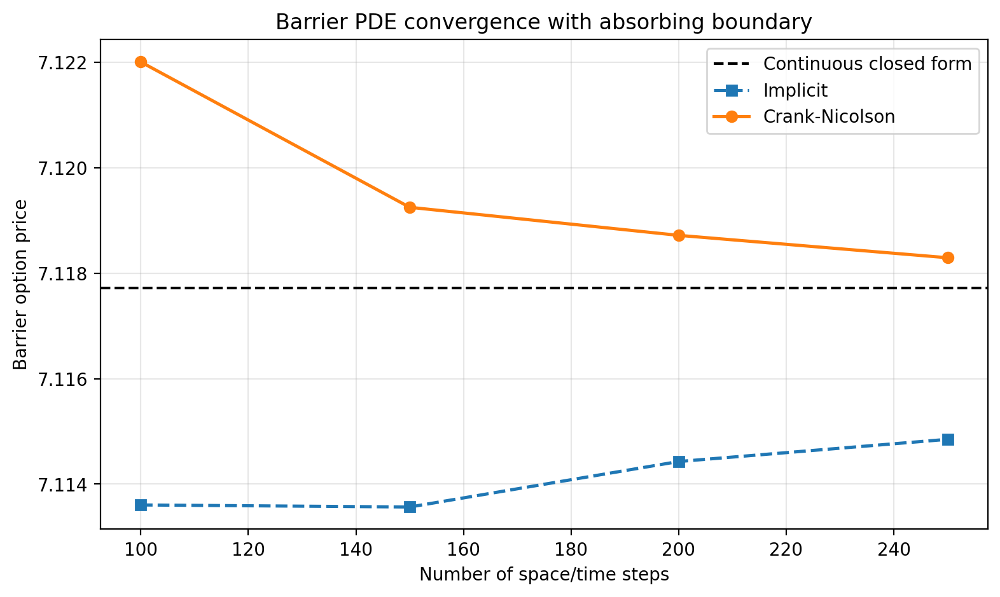
The absorbing-boundary approach gives very accurate results for the continuous-monitoring barrier price. For the up-and-in call, the implementation uses in/out parity: the vanilla call is split into up-and-in plus up-and-out, and the knock-out side can be handled naturally with a zero value at the barrier. The PDE prices are already close to the analytic up-and-in benchmark on relatively small grids. Crank-Nicolson is especially accurate, with the error falling to around 0.0006 at the finest grid shown. Runtime is also very low, mostly around a few hundredths of a second in the saved results. For this one-dimensional Black-Scholes barrier problem, PDE is therefore much faster and more accurate than Monte Carlo.

___